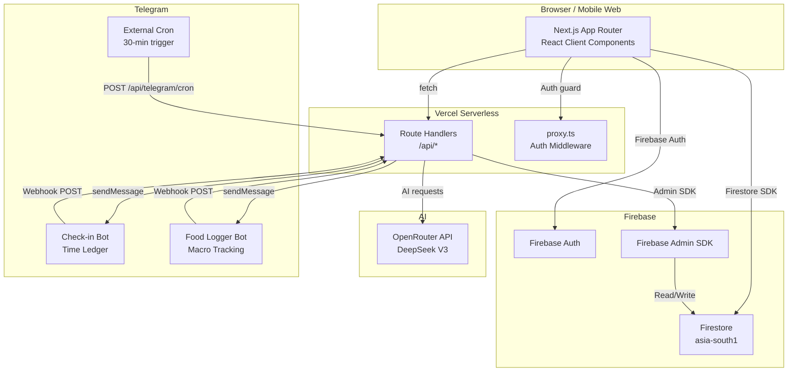

# LifeTracker — Personal Life OS

> **One dashboard to track everything that matters.** Habits, todos, goals, time, health, food, focus, and mood — unified in a single self-hosted, AI-augmented life operating system.

---

## The Problem

Most productivity apps solve one thing well and ignore everything else. You end up juggling 6–8 apps, losing context, and never seeing how your sleep affects your focus or how your stress triggers cravings. LifeTracker exists to fix that.

**Pain point:** Scattered self-tracking creates blind spots. When your habit app can't see your sleep data, and your todo app doesn't know how many deep-work blocks you logged, you're optimizing in silos.

## Who This Is For

This is a **personal, self-hosted** life operating system built for a single user. It's ideal for:

- Knowledge workers who want full data sovereignty over their productivity metrics
- Builders who prefer owning their stack over subscribing to SaaS tools
- People who want AI-generated insights from their *own* data, not aggregated population averages
- Anyone who has tried Notion, Habitica, Todoist, and Toggl simultaneously and wanted them in one place

---

## Features

### Core Tracking
- **Habits** — Daily/weekly habit tracking with streaks, completion rates, AI-suggested emoji, pause/resume all, and difficulty ratings. Supports count-based or boolean modes per habit.
- **Todos** — Personal and work queues with P1/P2/P3 priority, due dates, and AI-generated sub-task breakdowns.
- **Goals & Milestones** — Long-horizon goal tracking with linked milestone actions.
- **Time Ledger** — 30-minute time blocking for the full day. Bulk fill, gap detection, and AI analysis of how your day was actually spent.
- **Custom Trackers (Counters)** — Track anything countable (pages read, workouts, km run) with XP milestones, progress charts, and rewards.

### Health & Body
- **Food Log** — Log meals in plain English via Telegram or manually. AI fills macros automatically. Supports retrospective and future-date logging.
- **Sleep, Weight, Vitals** — Dedicated trackers with trend charts.
- **Apple Health Import** — Upload your Apple Health export ZIP; XML is parsed client-side and bulk-imported.
- **Cravings Tracker** — Log urges with the Atomic Habits framework (Cue → Craving → Response → Reward). Includes a 10-minute urge-surfing timer with guided 4-4-6-2 breathing.

### Mind & Focus
- **Command Center** — Daily home base: today's habits, time ledger, mood check-in, and quick todos.
- **Pomodoro** — Single-focus "what are you working on right now" mode with a timer.
- **Inbox** — Quick capture for unprocessed thoughts.
- **Overwhelm Panic Button** — One-tap grounding tool accessible from every page.

### AI & Automation
- **Telegram Check-in Bot** — Every 30 minutes the bot asks what you're working on. Reply to update the Time Ledger without opening the app.
- **Food Logger Bot** — Send "2 eggs and toast" to the food bot; AI parses and logs macros automatically.
- **AI Habit Sort** — Re-orders your habit list by AI-suggested optimal execution order.
- **AI Sub-task Breakdown** — Paste a todo title; AI generates a concrete checklist.
- **AI Macro Fill** — Describe a meal; AI estimates protein/carbs/fat/calories.
- **Correlation Engine** — Surfaces statistical relationships between tracked variables (e.g., high sleep → better habit completion).
- **Daily AI Summary** — Morning briefing via Telegram summarising your previous day.

### Gamification
- **XP System** — Earn XP for habits (+10), todos (+10), time blocks (+15), check-ins (+20), and milestones (+100).
- **Levels & Streaks** — Level up as XP accumulates. 7-day streaks earn bonus XP (+50).
- **Badges** — Earned automatically on key milestones.

---

## Tech Stack

| Category | Technology |
|---|---|
| Framework | Next.js 16.1.6 — App Router, TypeScript, Turbopack |
| Styling | Tailwind CSS v4, CSS custom properties |
| Auth | Firebase Authentication (Email/Password + Google OAuth) |
| Database | Cloud Firestore (`asia-south1`) |
| Server-side | Firebase Admin SDK (Node.js) |
| AI | OpenRouter API → DeepSeek V3 (`deepseek/deepseek-chat`) |
| Notifications | Telegram Bot API (two bots) |
| Deployment | Vercel (serverless, `bom1` / Mumbai region) |
| Charting | Recharts |
| Export | `xlsx`, `jszip` |

---

## System Architecture



**Data flow:** The browser talks directly to Firestore for most reads (using per-user security rules) and to serverless API routes for operations requiring admin access — Telegram bot callbacks, AI calls, and cross-user-validated writes. All Firestore documents include a `userId` field; security rules enforce users can only access their own data.

**Key architectural decisions:**
- Firebase is initialised lazily via getter functions (`firebaseAuth()`, `firebaseDb()`) to prevent SSR build failures in Next.js.
- The Firebase Admin SDK authenticates via a single `FIREBASE_SERVICE_ACCOUNT` environment variable (JSON string) rather than a file path.
- The Telegram cron is triggered by an external scheduler rather than Vercel's built-in crons (Hobby plan limitation).

---

## Getting Started

### Prerequisites

- Node.js 20+
- A Firebase project (Firestore + Authentication enabled)
- An OpenRouter API key
- Two Telegram bots created via @BotFather (optional — only needed for bot features)
- A Vercel account (for deployment)

### 1. Clone & Install

```bash
git clone https://github.com/your-username/life-tracker.git
cd life-tracker
npm install
```

### 2. Configure Environment Variables

```bash
cp .env.example .env.local
```

Open `.env.local` and fill in every key. See [`.env.example`](./.env.example) for the full list with descriptions.

### 3. Firebase Setup

1. Create a Firebase project at [console.firebase.google.com](https://console.firebase.google.com)
2. Enable **Authentication** (Email/Password + Google)
3. Enable **Firestore** in `asia-south1` (or your preferred region — update `config.ts` if you change it)
4. Go to **Project Settings → Service Accounts → Generate new private key**
5. Minify the downloaded JSON and paste it as the value of `FIREBASE_SERVICE_ACCOUNT` in `.env.local`
6. Deploy security rules and indexes:

```bash
npx firebase-tools deploy --only firestore:rules,firestore:indexes
```

### 4. Run the Dev Server

```bash
npm run dev
```

Open [http://localhost:3000](http://localhost:3000). Create an account — it is automatically provisioned as `plan: "pro"`.

### 5. Production Deployment

```bash
# Add all env vars to Vercel
vercel env add OPENROUTER_API_KEY production
vercel env add FIREBASE_SERVICE_ACCOUNT production
# ... (repeat for each key in .env.example)

vercel --prod
```

### 6. Register Telegram Webhooks (optional)

Run once after your first production deploy:

```bash
# Check-in bot
curl "https://api.telegram.org/bot<YOUR_BOT_TOKEN>/setWebhook" \
  -d "url=https://your-app.vercel.app/api/telegram/webhook&secret_token=<YOUR_WEBHOOK_SECRET>"

# Food bot
curl "https://api.telegram.org/bot<YOUR_FOOD_BOT_TOKEN>/setWebhook" \
  -d "url=https://your-app.vercel.app/api/telegram/food-webhook"
```

Set up an external cron service (cron-job.org, EasyCron, etc.) to call `GET https://your-app.vercel.app/api/telegram/cron` with header `Authorization: Bearer <YOUR_CRON_SECRET>` every 30 minutes.

---

## Repository Governance

### Roadmap

- [ ] **iOS PWA push notifications** — Replace Telegram check-ins with native Web Push for users who prefer it
- [ ] **Multi-user support** — Admin panel to onboard additional accounts (currently single-user by design)
- [ ] **Weekly review workflow** — Guided Sunday reflection with AI coaching on the past week's data
- [ ] **Pomodoro ↔ Todo integration** — Automatically link completed focus sessions to specific todos

### Contributing

See [CONTRIBUTING.md](./CONTRIBUTING.md) for setup instructions, coding conventions, and the PR process.

### Code of Conduct

This project follows the [Contributor Covenant](./CODE_OF_CONDUCT.md). Please read it before contributing.

### License

**GNU Affero General Public License v3.0 (AGPL-3.0)**

See [LICENSE](./LICENSE). If you run a modified version of this as a web service, you must make your modified source code available to your users under the same license.

### ⚖️ Legal & Ethics

Use of this codebase is governed by the AGPL-3.0 license **and** the ethical guidelines in [TERMS_OF_USE.md](./TERMS_OF_USE.md). This project is intended for **personal, non-commercial use**. The terms cover attribution requirements, data sovereignty principles, and anti-exploitation guidelines. Vulnerability reports belong in [SECURITY.md](./SECURITY.md) — not in public Issues.

### Acknowledgments

- [DeepSeek](https://deepseek.com) / [OpenRouter](https://openrouter.ai) — AI inference backbone
- [Firebase](https://firebase.google.com) — Authentication and database
- [Recharts](https://recharts.org) — Charting library
- [Next.js](https://nextjs.org) by Vercel — Application framework
- *Atomic Habits* by James Clear — Conceptual framework for the Cravings module

---

<sub>Built and maintained as a personal project. Not affiliated with any of the above services.</sub>
