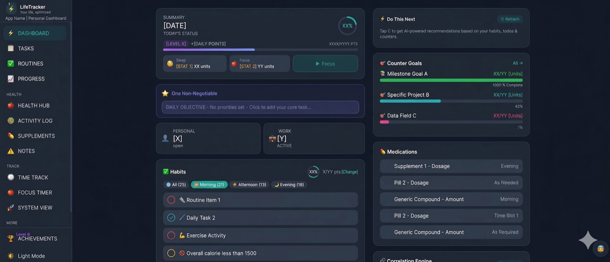
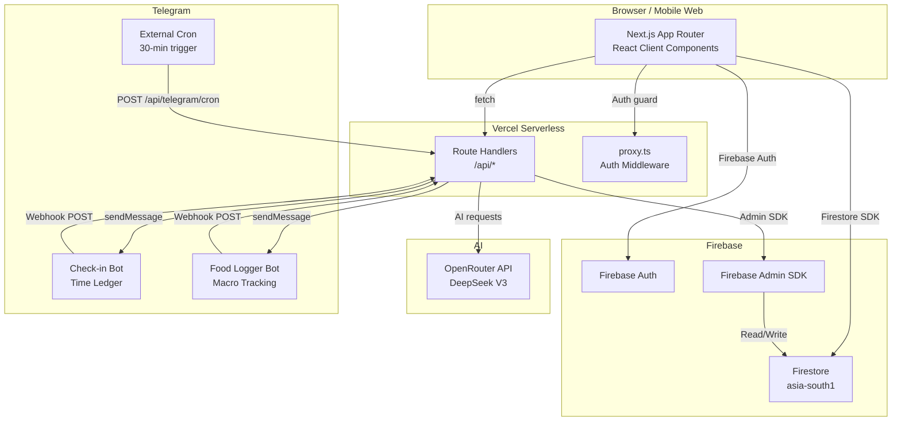

<p align="center">
  
</p>

<h1 align="center">LifeTracker — Open-Source Personal Life OS</h1>

<p align="center">
  <strong>Self-hosted habit tracker, time blocker, health logger, and AI productivity assistant — built with Next.js 16, Firebase, and Telegram bots.</strong>
</p>

<p align="center">
  <a href="https://github.com/ashishworkacc/life-tracker/blob/main/LICENSE">
    
  </a>
  <a href="https://nextjs.org">
    
  </a>
  
  <a href="https://firebase.google.com">
    
  </a>
  
  
</p>

<p align="center">
  <a href="https://life-tracker-silk.vercel.app">Live Demo</a> ·
  <a href="#-quick-start-3-minutes">Quick Start</a> ·
  <a href="#features">Features</a> ·
  <a href="#system-architecture">Architecture</a>
</p>

---

> **⭐ If this saves you from paying for 6 productivity apps, a star helps others find it.**

---

## What Is This?

**LifeTracker is a self-hosted, open-source life OS** — a single Next.js app that replaces Habitica, Toggl, Todoist, MyFitnessPal, and a journaling app simultaneously. All your data lives in your own Firebase project. No subscriptions. No vendor lock-in.

The killer feature: **two Telegram bots do the data entry for you.** Every 30 minutes, the check-in bot asks what you're working on. You reply in plain text — your Time Ledger updates without opening the app. The food bot works the same way: send *"2 eggs and coffee"*, AI estimates the macros and logs them.

**Built for developers and knowledge workers** who want AI-generated insights from their *own* data — not population averages from a SaaS product.

---

## 🚀 Quick Start (3 minutes)

```bash
# 1. Clone and install
git clone https://github.com/ashishworkacc/life-tracker.git
cd life-tracker && npm install

# 2. Configure (Firebase + OpenRouter keys)
cp .env.example .env.local
# Edit .env.local — minimum required: Firebase keys + OPENROUTER_API_KEY

# 3. Run
npm run dev
# Open http://localhost:3000 → sign up → you're in
```

The Telegram bots and Apple Health import are optional. The core app works with just Firebase + OpenRouter.

---

## Features

### Core Tracking
- **Habits** — Daily/weekly streaks, AI-suggested emoji, count-based or boolean, pause/resume all, difficulty ratings
- **Todos** — P1/P2/P3 priority, due dates, AI-generated sub-task breakdown per item
- **Goals & Milestones** — Long-horizon tracking with linked actions
- **Time Ledger** — 30-minute time blocking, bulk fill, gap detection, AI day analysis
- **Custom Counters** — Track anything countable with XP milestones and progress charts

### Health & Body
- **Food Log** — Plain-English Telegram input or manual entry; AI fills macros. Supports retrospective dates.
- **Sleep, Weight, Vitals** — Dedicated trackers with trend charts
- **Apple Health Import** — Upload the Health export ZIP; XML parsed client-side, bulk-imported to Firestore
- **Cravings Tracker** — Atomic Habits framework (Cue → Craving → Response → Reward) + 10-min urge surfing timer

### AI & Automation
- **Telegram Check-in Bot** — 30-min nudge → reply in plain text → Time Ledger updated passively
- **Food Logger Bot** — "2 eggs and toast" → AI parses → macros logged automatically
- **AI Habit Sort** — Re-orders habit list by AI-suggested optimal execution order
- **AI Sub-task Breakdown** — Paste any todo title → AI generates a concrete step list
- **Correlation Engine** — Surfaces relationships between your tracked variables (sleep ↔ focus, etc.)
- **Daily AI Summary** — Morning Telegram briefing on yesterday's stats

### Gamification
- **XP System** — Habits (+10), todos (+10), time blocks (+15), check-ins (+20), milestones (+100)
- **Levels & Streaks** — Exponential XP curve: `200 × 1.5^(level−1)` per level
- **Badges** — Automatically awarded on key milestones

---

## Tech Stack

| Category | Technology |
|---|---|
| Framework | Next.js 16.1.6 — App Router, TypeScript, Turbopack |
| Styling | Tailwind CSS v4, CSS custom properties |
| Auth | Firebase Authentication (Email/Password + Google OAuth) |
| Database | Cloud Firestore (`asia-south1`), 25+ collections |
| Server-side | Firebase Admin SDK (Node.js) |
| AI | OpenRouter API → DeepSeek V3 (`deepseek/deepseek-chat`) |
| Notifications | Telegram Bot API (two bots) |
| Deployment | Vercel serverless (`bom1` / Mumbai) |
| Charting | Recharts |
| Export | `xlsx`, `jszip` |

---

## System Architecture



**Key decisions:**
- Firebase initialised lazily via getter functions (prevents Next.js SSR failures)
- Firebase Admin authenticates via a single `FIREBASE_SERVICE_ACCOUNT` env var (JSON string, no file)
- Telegram cron triggered by external scheduler — works on Vercel Hobby plan
- All Firestore documents carry `userId`; security rules enforce per-user isolation

---

## Getting Started

### Prerequisites

- Node.js 20+
- Firebase project (Firestore + Auth enabled — free Spark plan works)
- OpenRouter API key ([openrouter.ai/keys](https://openrouter.ai/keys) — free tier available)
- Telegram bots via @BotFather (optional)

### 1. Clone & Install

```bash
git clone https://github.com/ashishworkacc/life-tracker.git
cd life-tracker
npm install
```

### 2. Configure Environment

```bash
cp .env.example .env.local
# Fill in Firebase client keys + OPENROUTER_API_KEY at minimum
```

See [`.env.example`](./.env.example) for every variable with descriptions.

### 3. Firebase Setup

1. Create a project at [console.firebase.google.com](https://console.firebase.google.com)
2. Enable **Authentication** (Email/Password + Google)
3. Enable **Firestore** in `asia-south1`
4. Go to **Project Settings → Service Accounts → Generate new private key**
5. Minify the JSON (`jq -c . key.json`) and set it as `FIREBASE_SERVICE_ACCOUNT`
6. Deploy rules:

```bash
npx firebase-tools deploy --only firestore:rules,firestore:indexes
```

### 4. Run

```bash
npm run dev   # http://localhost:3000
```

Sign up — your account is automatically provisioned.

### 5. Deploy to Vercel

```bash
vercel env add OPENROUTER_API_KEY production
vercel env add FIREBASE_SERVICE_ACCOUNT production
# repeat for remaining keys
vercel --prod
```

### 6. Register Telegram Webhooks (optional)

```bash
# Check-in bot
curl "https://api.telegram.org/bot<TOKEN>/setWebhook" \
  -d "url=https://your-app.vercel.app/api/telegram/webhook&secret_token=<WEBHOOK_SECRET>"

# Food bot
curl "https://api.telegram.org/bot<FOOD_TOKEN>/setWebhook" \
  -d "url=https://your-app.vercel.app/api/telegram/food-webhook"
```

Set up a cron job (cron-job.org, EasyCron) to call `/api/telegram/cron` with `Authorization: Bearer <CRON_SECRET>` every 30 minutes.

---

## Repository Governance

### Roadmap

- [ ] iOS PWA push notifications (replace Telegram check-ins with Web Push)
- [ ] Multi-user support with admin panel
- [ ] Guided weekly review workflow with AI coaching
- [ ] Pomodoro ↔ Todo automatic session linking

### Contributing

See [CONTRIBUTING.md](./CONTRIBUTING.md). Run `npx tsc --noEmit` before submitting a PR — zero type errors required.

### Code of Conduct

[Contributor Covenant](./CODE_OF_CONDUCT.md)

### License

**AGPL-3.0** — If you run a modified version as a web service, you must share the modified source with your users. See [LICENSE](./LICENSE).

### ⚖️ Legal & Ethics

Governed by [TERMS_OF_USE.md](./TERMS_OF_USE.md). Personal non-commercial use. Attribution required for public forks. Security vulnerabilities → [SECURITY.md](./SECURITY.md), not public Issues.

### Acknowledgments

- [OpenRouter](https://openrouter.ai) / [DeepSeek](https://deepseek.com) — AI inference
- [Firebase](https://firebase.google.com) — Auth and database
- [Recharts](https://recharts.org) — Charts
- [Next.js](https://nextjs.org) — Framework
- *Atomic Habits* by James Clear — Cravings module framework

---

<sub>Personal project. Not affiliated with any referenced services.</sub>
